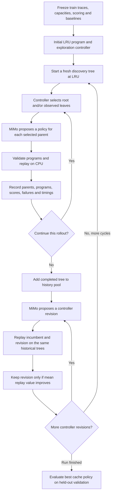

# Dream-RSI harness

This implements the two-level search described in
[Dream-RSI, main §3](https://arxiv.org/abs/2609.14858), specialized to our CPU
prefix-cache simulator. It is a bounded expression-program adaptation, not an
exact reproduction of the paper's general coding-agent environment or benchmark.

There are three distinct actors:

| Actor | What it does | Can change during a run? |
| --- | --- | --- |
| MiMo discovery role | Proposes a cache eviction program given a parent and feedback | Its output programs change; its weights do not |
| Cache evaluator | Replays fixed workloads and measures the proposed policy | No: suite and scoring are fixed |
| Exploration controller | Chooses fresh branches, refinements, and when to stop | Revised between discovery rollouts through historical replay |

The same MiMo API model serves both discovery and controller-development roles.
Controller execution itself is local arithmetic, with no LLM call per decision.
There is no model training, gradient update, local inference, or GPU requirement.



## Run it

Run commands from the repository root. The default backend is a deterministic
mock, so forgetting `--backend mimo` cannot incur API charges.

```sh
# Complete two-loop smoke test on small synthetic workloads, no API calls.
uv run --locked python -m dream_rsi --config configs/dream-smoke.json --backend mock

# Exercise real local dataset shards with deterministic mock proposals.
uv run --locked python -m dream_rsi --config configs/dream-datasets.json --backend mock

# Live transport check: at most 2 calls, estimated budget $0.10.
uv run --locked python -m dream_rsi --config configs/dream-live-smoke.json --backend mimo

# Real proposal search on the small fixed dataset suite.
uv run --locked python -m dream_rsi --config configs/dream-datasets.json --backend mimo \
  --max-usd 0.50 --max-calls 24
```

MiMo reads `XIAOMI_API` from the environment or the repository `.env`. It is never
put in prompts or saved reports. Trace contents are not sent to MiMo: prompts
contain program expressions and aggregate evaluator feedback. The API endpoint
is fixed to `https://api.xiaomimimo.com/v1/chat/completions`; redirects are disabled.

The live smoke is a connectivity/contract test, not a meaningful optimization
experiment: one cache candidate, one controller revision, then validation.
It explicitly disables thinking and caps completion at 2048 tokens. The dataset
configuration enables thinking with a 32768-token cap. MiMo's
[completion cap includes reasoning tokens](https://mimo.mi.com/docs/en-US/api/chat),
so a small cap in thinking mode can produce no final JSON at all. Truncated
responses become recorded failures; the harness does not silently change modes
or retry. Thinking is a recorded configuration choice, not an implicit API default.
The dataset configuration is also a small development suite: first training and
validation shard from each dataset at 2048 and 4096 blocks (16 tokens per block).
It does not evaluate all 998 prepared shards. Each scenario is a cold-start episode.

## 1. Freeze the task evaluator

Before generation, hash each input trace and record source-code hashes, config,
block size and capacities. Run unlimited-cache, LRU, LFU and FIFO references.
Each generated cache policy is then replayed on precisely the training scenarios.
Trace hashes are checked again inside each evaluation. An oversized request is
an error; the harness never silently truncates it or increases its cache capacity.

The default objective is now `total_extra_v2`. For each scenario, extra tokens
are prompt computation beyond an unlimited-cache replay. Sum the token counts
across the entire fixed suite, then normalize once:

```text
total_extra(policy) = sum of extra computed prompt tokens across scenarios
task_score = (total_extra(LRU) - total_extra(candidate)) / max(1, total_extra(LRU))
```

LRU scores zero. When the LRU suite total is positive, a score of 0.10 means
10% fewer extra recomputed tokens across the suite. Every saved token has equal
value, regardless of dataset, shard, or capacity. More total recomputation always
produces a lower score; a positive score requires fewer tokens overall.

A scenario where LRU has zero extra tokens uses the same suite denominator as
all other scenarios. If LRU has zero extra tokens on the entire suite, the
normalizer is 1: matching it scores zero, and each extra token scores -1; there
is no percentage-improvement interpretation in that all-zero case.

The workload mix is determined by the trace suite. There is no additional 50/50
dataset weighting: a token saved in either dataset has the same value. Each
capacity remains a separate scenario, so repeating a trace at another capacity
adds another episode to the objective. CPU cost remains a separate feasibility
gate rather than part of the token score.

The previous objective, `mean_relative_v1`, averaged scenario-level relative
improvements. It remains available explicitly for historical comparisons; it is
not the default. Its per-scenario diagnostic is still recorded, but the new
prompts use token savings and contributions to the suite score. Configurations,
evaluator outputs, summaries and historical replay outputs identify the objective
version. Existing recorded histories retain their original scores during replay.

Reports retain computed/reused/extra tokens, eviction count, occupied blocks,
policy microseconds per request, and replay timing. CPU policy time has a
configurable feasibility gate (`max_policy_us_per_request`, initially a loose
50,000 µs/request). This version optimizes recomputation subject to that limit;
it does **not** jointly optimize a calibrated GPU-time or dollar-cost model.
Evictions are recorded, not modeled as a CPU↔GPU swap tier. The expression
interpreter adds overhead relative to handwritten baseline Python, so CPU timing
is useful for rejecting slow candidates, not a serving-latency claim.

## 2. Represent a candidate cache program

Example:

```json
{
  "name": "frequency-with-recency-decay",
  "retention_score": "frequency / (1 + now - last_access)",
  "rationale": "Retain repeatedly accessed blocks, with age decay."
}
```

Whenever eviction is necessary, evaluate this score on each currently eligible
entry and evict the lowest score. Ties use least-recent access order. The simulator
determines eligibility: active blocks are pinned; only leaf blocks can be evicted
so cached prefixes remain usable. The policy cannot change those rules.

Allowed features are `now`, `depth`, `inserted_at`, `last_access`, `frequency`,
`insertion_order` and `access_order`. Token IDs, block IDs, request identifiers,
dataset names and future trace events are unavailable to the generated program.
Programs have no custom persistent state in this version, beyond engine metadata.

The parser accepts arithmetic, comparisons, boolean operators, conditional
expressions and five numeric functions. It rejects imports, attributes,
subscripts, loops, exponentiation and arbitrary calls. Each expression is limited
to 1000 characters, 96 AST nodes, depth 12, and bounded finite numbers. There is
no `eval` or `exec`. The trusted interpreter is the execution boundary; a child
process adds a wall-time limit to each evaluation. A subprocess alone would
**not** safely contain arbitrary generated Python. This harness does not run it.

## 3. Online discovery: spend new proposal calls

Each cycle starts a new tree whose root is the original LRU program. The incumbent
controller remains fixed for that entire rollout. Completed prior rollouts can
inform the discovery prompt through their best observed policies, but are not
inserted as observed nodes in the new tree.

At each round, the controller chooses up to `workers` distinct parents:

- **Root:** open one fresh attempt from LRU. The root is selectable once per batch.
- **Observed leaf:** refine that candidate. A non-root node can receive only one
  child, so the tree consists of refinement chains attached to the root.
- **Empty batch:** stop the rollout.

MiMo receives the selected parent, recent observed programs/results and fixed
task instructions. Calls within a batch run concurrently; their results become
available to the controller together on the next round. Evaluations run serially
after generation to reduce CPU timing interference. This means the replay's
parallelism bonus measures proposal batching, not measured end-to-end speedup.

An invalid response, invalid expression, arithmetic error, timeout or excessive
CPU cost is a recorded failed attempt. Failures still consume attempt budget.
The controller can try to repair a failed leaf. The initial valid LRU always
remains eligible as the overall best program, so an all-failure run preserves it.

Controller programs define `root_if`, `root_priority`, `leaf_if`, `leaf_priority`.
Eligible actions are sorted by descending priority. The wrapper enforces unique
actions, maximum batch width, branch depth and round limits. Runtime features
include attempts so far, best observed score, branch score, recent gain, depth,
consecutive failures and stagnation. Priorities cannot access hidden outcomes.

## 4. Offline controller improvement: reuse recorded attempts

Append the completed tree to a history pool. Ask MiMo's controller-development
role to propose new controller expressions. It can see historical results and
prior revision feedback; that is the training data for its proposal. The resulting
controller, when executed, only receives observations revealed so far.

For every candidate controller and every historical tree:

1. Reset visible state to the LRU root.
2. Let the controller choose a batch using only visible observations.
3. Selecting root reveals the earliest recorded, unrevealed root child. Selecting
   a leaf reveals its recorded child, if any. No new LLM call or simulator run occurs.
4. A missing continuation becomes exhausted when selected. It consumes a round
   slot, but contributes no new generation call. Stop when the controller returns
   no actions, the replay round cap is reached, or all recorded nodes are revealed.
5. Compute value and average it over the same history pool for every revision.

We use the paper's main-method objective:

```text
V = best observed task score - beta_calls * N
    + beta_parallel * N / max(1, replay_rounds_used)
```

`N` counts revealed attempts, including failures. The first term rewards finding
a good policy; the second penalizes attempts; the third rewards batching. Defaults
are `beta_calls=0.02`, `beta_parallel=0.005`. These values need calibration to the
task-score scale: when small gains do not justify the attempt penalty, stopping
immediately can legitimately win. This is an explicit cost preference, not proof
that further discovery is useless. The paper's appendix describes a different
AUC/grid-search objective; that alternative is not implemented here.

Keep a revision only if its mean replay value strictly exceeds the incumbent's
on the identical history pool. Include the incumbent in each comparison. The
selected controller governs the next fresh online rollout. The final cycle also
produces a revised controller, saved for inspection; there need not be another
online rollout in the current run that uses it.

Better replay value guarantees improvement only on those recorded histories.
Replay cannot create unseen branches or regenerate an outcome under different
LLM context. Finite history support, LLM randomness and overfitting can all make
future online performance worse. Evaluate controllers on new rollouts before
claiming a general improvement in search efficiency.

Replay saved histories independently, with no API key or calls:

```sh
uv run --locked python -m dream_rsi.replay \
  --run runs/EXISTING_RUN \
  --controller runs/EXISTING_RUN/controller-final.json
```

## 5. Validation, budgets and saved evidence

After all cycles, evaluate the single best training policy once on held-out
validation traces. Validation feedback is not sent to MiMo or used to select a
winner. Explicit train/validation/test paths are checked, and matching trace hashes
or synthetic seeds/configurations across train and validation are rejected.
Arbitrary renamed inputs still require the experimenter to ensure genuine group
separation. The dataset-preparation script handles conversation/document grouping.
The test split is left untouched. Repeated tuning against validation eventually
overfits it too; reserve test data for the final experiment.

The API ledger counts discovery **and controller-development** requests. Replay
itself costs zero API tokens. Calls have a completion-token cap and connect/read
timeouts. There is no automatic retry. Concurrent calls reserve estimated cost
under a lock before dispatch; calls that would exceed the estimated-dollar or
call-count budget are not sent. Budget exhaustion preserves completed work and
still runs local validation. It is a normal stop reason, recorded in the summary.

Default MiMo Pro accounting uses $0.435/M uncached input tokens and $0.87/M output
tokens, from the [MiMo pricing page](https://mimo.mi.com/docs/en-US/price/pay-as-you-go)
checked on 2026-09-27. Rates are configurable and may change. Reported API token
usage replaces the reservation on success; cache discounts are conservatively
ignored. Failed requests without usage retain their reservation. The input
reservation uses a conservative UTF-8-byte allowance, not our Qwen workload
tokenizer. This is an **estimated spending guard**, not a provider-enforced invoice
cap; configure account-side limits for a hard billing constraint.

Each run gets a new directory under `runs/` (ignored by Git):

| File | Evidence |
| --- | --- |
| `config.json`, `source-hashes.json` | Frozen suite, trace hashes, settings, implementation hashes |
| `baselines.json`, `initial-policy-evaluation.json` | Unlimited/LRU/LFU/FIFO measurements and initial expression feasibility |
| `prompts/`, `candidates/` | Exact user prompts, returned programs and task feedback |
| `tree-NNN.json` | Parent relationships, outcomes, rollout controller |
| `controller-revisions-NNN.json` | Every revision, replay trajectories, values, acceptance |
| `best-policy.json`, `controller-final.json` | Selected task program and controller |
| `validation*.json` | Final held-out evaluation and its references |
| `usage.json`, `events.jsonl`, `summary.json` | Calls, estimated cost, progress, final status |

Normal failures/interruption preserve completed records. Automatic resume is not
implemented; use a new output directory to start another run. Keep the relevant
Git revision as well as the recorded hashes for reproducibility. Token scores are
deterministic on fixed traces/programs; CPU timings and real MiMo generations are
not. Tests run with `uv run --locked python -m unittest discover -s tests -v`.

The next experimental step is a larger **fixed** train/validation suite and a
comparison between frozen-controller search and controller-adaptive search at
equal total API budgets. Treat the current smoke configurations as plumbing checks,
not evidence of recursive self-improvement or production serving performance.
